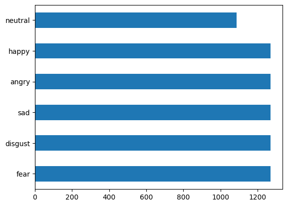
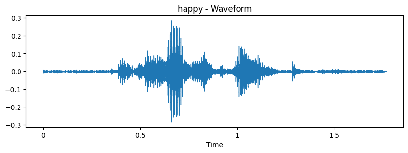
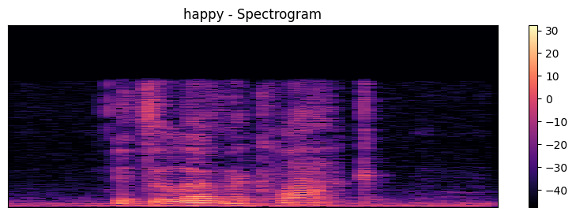
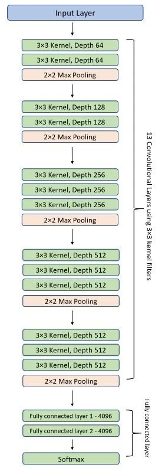
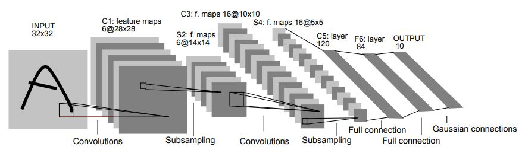
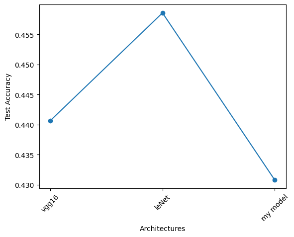
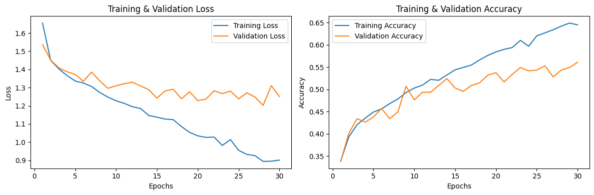
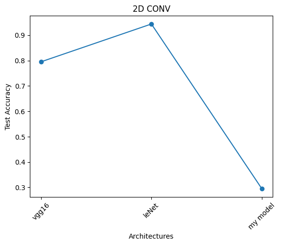
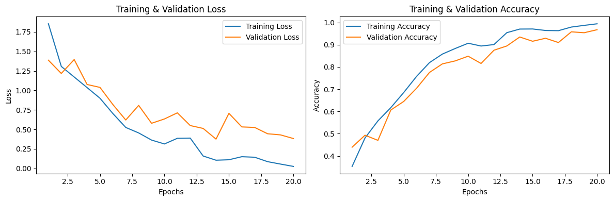

# Speech Emotion Recognition (CNN)

End-to-end **speech emotion recognition (SER)** pipeline built around the **CREMA-D** dataset and multiple convolutional neural network (CNN) architectures.

The notebook trains and compares:

- **1D CNNs** on a compact **handcrafted + averaged spectral feature vector** (Feature Space 1)
- **2D CNNs** on **Mel-spectrograms** (Feature Space 2)

Emotions covered (6 classes): **angry, disgust, fear, happy, neutral, sad**

---

## Project overview

Speech Emotion Recognition (SER) aims to classify human speech into emotion categories.
This project implements a complete workflow:

1. Download and load audio files
2. Inspect label distribution and audio examples
3. Create augmented training data
4. Extract two types of features:
   - **Feature Space 1 (FS1)**: 1D feature vector (169 dims)
   - **Feature Space 2 (FS2)**: 2D Mel-spectrogram image (128 × 216)
5. Train multiple CNN architectures and compare test accuracy
6. Save trained models (`.h5`) for later use

---

## Dataset

The notebook uses the Kaggle dataset **“speech-emotion-recognition-en”** and specifically the **CREMA-D** subset.

From the provided notebook run:

- Total files parsed: **7,442**
- Class distribution (counts):

| Emotion   | Count |
|----------:|------:|
| fear      | 1,271 |
| disgust   | 1,271 |
| sad       | 1,271 |
| angry     | 1,271 |
| happy     | 1,271 |
| neutral   | 1,087 |

---

## Methodology

### 1) Data loading & labeling

Audio files are listed from the `Crema` directory.  
Labels are extracted from filenames (3rd underscore-separated token) and mapped:

- `SAD → sad`
- `ANG → angry`
- `DIS → disgust`
- `FEA → fear`
- `HAP → happy`
- `NEU → neutral`

A dataframe is constructed with:

- `Path`: absolute/relative path to `.wav`
- `Emotion`: normalized emotion label

### 2) Quick EDA

The notebook visualizes:

- **Waveform** (time-domain amplitude)
- **Spectrum** (frequency magnitude)
- **Spectrogram** (time–frequency energy)

Example (happy):

### 3) Train/test split

A stratified split is used:

- **Train+Val:** 70%
- **Test:** 30%

### 4) Data augmentation

Training audio is augmented to increase robustness.

Currently enabled in the notebook:

- **Additive white noise**
  - `noise_factor=0.01` (fixed seed for reproducibility)

Additional augmentations exist in the code but are commented out:

- Pitch shifting
- Time stretching

### 5) Feature extraction

Common settings:

- `FRAME_LENGTH = 2048`
- `HOP_LENGTH = 512`
- `librosa.load()` uses the default sampling rate (typically resampled to 22050 Hz)

#### Feature Space 1 (FS1): 169‑D vector

FS1 is formed by concatenating **mean-pooled** statistics across frames:

| Feature | Description | Dim |
|---|---|---:|
| ZCR | Zero-crossing rate (mean over frames) | 1 |
| RMS | Energy (mean over frames) | 1 |
| MFCC | Mel-frequency cepstral coefficients (mean over frames) | 20 |
| Chroma | Pitch class intensity (mean over frames) | 12 |
| Spectral contrast | Peak/valley contrast in spectrum (mean over frames) | 7 |
| Mel-spectrogram (1D) | Mel power spectrum averaged over time | 128 |
| **Total** |  | **169** |

FS1 is used as input to **Conv1D** networks after reshaping to `(169, 1)`.

#### Feature Space 2 (FS2): Mel‑spectrogram “image”

FS2 uses the full 2D Mel-spectrogram:

- Shape before padding: `(n_mels=128, time_frames=variable)`
- The notebook **pads** all samples to a common frame length, resulting in:
  - `(128, 216)` in the provided run
- Final CNN input shape: `(128, 216, 1)`

### 6) Encoding & shaping

- Labels are **one-hot encoded** into 6 classes.
- A small validation split is created from training data:
  - **Validation:** 5% of the training set

From the notebook run:

- FS1 shapes:  
  - Train: `(9897, 169, 1)`  
  - Val: `(521, 169, 1)`  
  - Test: `(2233, 169, 1)`

- FS2 shapes:  
  - Train: `(9897, 128, 216, 1)`  
  - Val: `(521, 128, 216, 1)`  
  - Test: `(2233, 128, 216, 1)`

---

## Models

All models are trained with:

- Optimizer: **Adam**
- Learning rate: **0.001**
- Loss: **categorical_crossentropy**
- Metric: **accuracy**

### 1D CNN models

1D CNNs operate on FS1 (169×1):

- **VGG16-like Conv1D** (stacked conv blocks)
- **LeNet-5 Conv1D** (classic small CNN)
- **Custom Conv1D** (higher filter count, multiple pooling stages)
- *(AlexNet-like Conv1D is defined but was not executed in the saved run outputs.)*

Reference architecture diagrams:

### 2D CNN models

2D CNNs operate on FS2 (Mel-spectrogram 128×216×1):

- **VGG16-like Conv2D**
- **LeNet-5 Conv2D**
- **Custom Conv2D**
- *(AlexNet-like Conv2D is defined but was not executed in the saved run outputs.)*

---

## Results

**Note:** The numbers below are taken directly from the provided notebook execution outputs and will vary with different random splits, augmentation choices, preprocessing settings, and training time.

### 1D CNN on FS1 (30 epochs)

| Model | Test Accuracy | Test Loss |
|---|---:|---:|
| VGG16‑1D | 0.4407 | 1.7204 |
| LeNet‑1D | 0.4586 | 2.2503 |
| Custom‑1D | 0.4308 | 1.4508 |

Training curves (LeNet‑1D):

### 2D CNN on FS2 (20 epochs)

| Model | Test Accuracy | Test Loss |
|---|---:|---:|
| VGG16‑2D | 0.7951 | 0.6357 |
| LeNet‑2D | **0.9441** | 0.4010 |
| Custom‑2D | 0.2951 | 1.6414 |

Training curves (LeNet‑2D):

---

## How to run

### Option A: Google Colab

The notebook is written for Colab and includes:

1. Mount Google Drive
2. Install Kaggle CLI
3. Upload `kaggle.json`
4. Download & unzip dataset
5. Set paths:
   - `save_path` (where to store `.pkl` and `.h5`)
   - `Crema` (folder containing CREMA `.wav` files)

Then run the notebook top-to-bottom.

### Option B: Local run

Recommended approach for local execution:

1. Create a virtual environment
2. Install dependencies:
   - `tensorflow`
   - `librosa`
   - `numpy`, `pandas`
   - `scikit-learn`
   - `matplotlib`, `seaborn`
3. Download the dataset and set:
   - `Crema = "path/to/data/Crema"`
   - `save_path = "path/to/artifacts/"`

---

## Inference

To run inference on a new audio file, you must apply **the same feature extraction** used during training.

High-level steps:

1. Load audio with `librosa.load(path)`
2. Extract either:
   - FS1 via `extract_features(audio, sr)` → reshape to `(1, 169, 1)`
   - FS2 via `mel_spectrogram2D(audio, sr)` → pad to `(128, 216)` → reshape to `(1, 128, 216, 1)`
3. Load a saved `.h5` model and call `model.predict(...)`
4. Decode predicted one-hot probabilities back into the emotion label

> Tip: If you use scaling/normalization, save the fitted scaler and reuse it at inference time.

---

